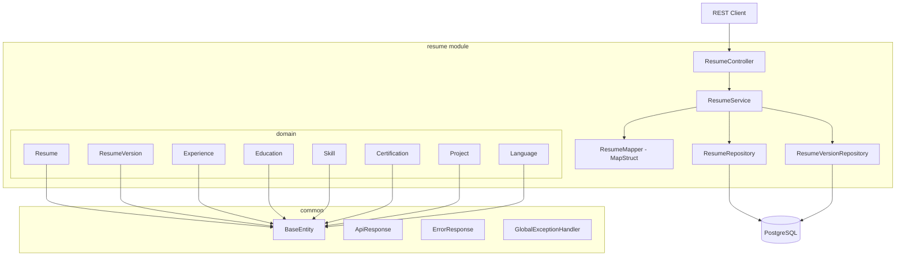
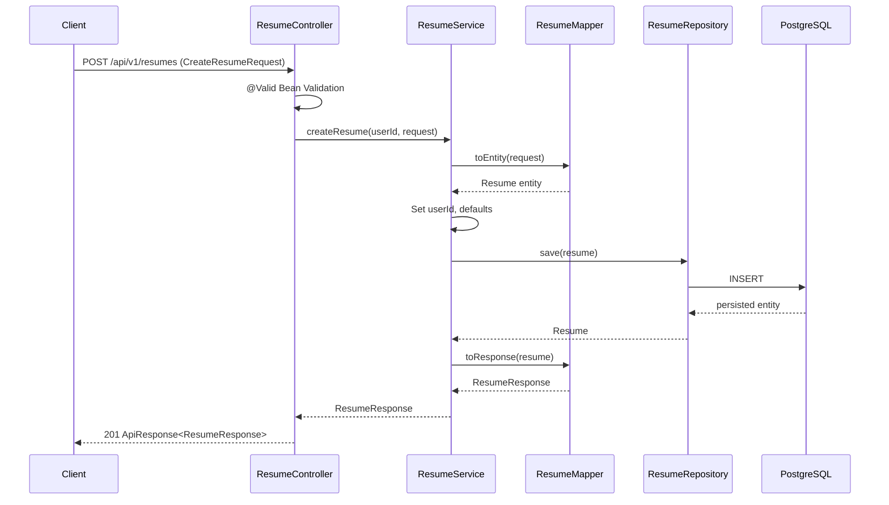
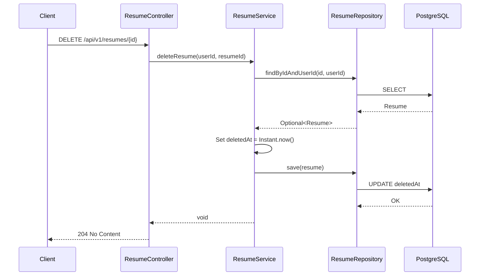

# Design Document: Resume Domain Foundation

## Overview

The Resume Domain Foundation establishes the core business model for CareerPilot AI's resume management. This module implements a production-grade Resume aggregate following DDD principles, with a REST API, proper validation, and clean separation of concerns. It is designed to support future AI features (parsing, tailoring, comparison, export) without requiring domain model changes.

This design prioritizes simplicity, correctness, and maintainability over premature optimization. Every relationship, cascade strategy, and field decision is justified with alternatives and trade-offs explained.

## Architecture



## Sequence Diagrams

### Create Resume Flow



### Delete Resume Flow (Soft Delete)




## Design Decisions

### Decision 1: Resume as Aggregate Root

**Choice:** Resume is the Aggregate Root for the resume domain.

**Why:** All child entities (Experience, Education, Skill, etc.) have no independent lifecycle — they exist only within the context of a Resume. No external module ever needs to query an Experience independently; it's always accessed through its parent Resume.

**Alternatives Considered:**
- *Flat entities with independent repositories:* Each entity gets its own repository and service. This is simpler initially but violates DDD boundaries — you'd have orphaned Experiences with no Resume, no transactional consistency guarantees, and cross-entity invariants become impossible to enforce.
- *User as aggregate root:* Too broad. The User aggregate would grow unboundedly and couple authentication with resume management.

**Trade-offs:** Using Resume as aggregate root means all child entities are loaded/saved through the Resume. This can lead to large object graphs on read, mitigated by LAZY fetching and targeted JPQL queries.

---

### Decision 2: User-Resume Relationship — Store userId (UUID) vs @ManyToOne

**Choice:** Store `userId` as a plain `UUID` column on Resume. Do NOT create a `@ManyToOne` relationship to the `User` entity.

**Why:**
1. **Module boundary:** The auth module and resume module are separate feature modules. A JPA relationship would create a compile-time and runtime coupling between them.
2. **Independent lifecycle:** Resumes don't need to eagerly/lazily load the full User entity. The userId is sufficient for ownership queries.
3. **Scalability:** In a future microservice split, a foreign key across service boundaries is impossible. A UUID reference is portable.
4. **Query patterns:** All resume queries filter by `WHERE user_id = ?` — a UUID column with an index is sufficient.

**Alternatives Considered:**
- *@ManyToOne(fetch = LAZY) to User:* Provides referential integrity at the DB level but couples the modules. If we later split resume into its own service, this becomes technical debt.
- *Shared kernel / common User reference entity:* Overly complex for this stage.

**Trade-offs:** No Hibernate-level cascading from User deletion. A listener or application-level cascade handles user account deletion (future sprint). Database-level `ON DELETE` can still be applied via Flyway if needed.

---

### Decision 3: Soft Delete Strategy — `Instant deletedAt` vs `boolean deleted`

**Choice:** Use `Instant deletedAt` (nullable) on Resume entity only.

**Why:**
1. **Auditability:** `deletedAt` tells us *when* it was deleted, not just *if*. Critical for compliance, debugging, and potential "restore within 30 days" features.
2. **Query simplicity:** `WHERE deleted_at IS NULL` is clean and indexable.
3. **Only on aggregate root:** Child entities don't need soft delete — they follow the Resume's lifecycle. If the Resume is soft-deleted, its children are implicitly soft-deleted.

**Alternatives Considered:**
- *`boolean deleted`:* Loses temporal information. Slightly smaller column but negligible.
- *Hibernate `@Where` annotation:* Auto-filters deleted resumes globally. Dangerous — makes it impossible to query deleted resumes for admin/restore features. Prefer explicit repository methods.
- *Separate "trash" table:* Adds complexity, breaks referential integrity, harder to restore.
- *`@SQLDelete` override:* Hijacks Hibernate's delete mechanism. Makes debugging harder and surprises future developers.

**Trade-offs:** Every query must explicitly filter `deletedAt IS NULL`. This is intentional — explicit is better than implicit. Repository method naming makes this obvious: `findByUserIdAndDeletedAtIsNull`.


---

### Decision 4: ResumeVersion Storage — JSON Column vs Separate Normalized Tables

**Choice:** Store version snapshots as a JSONB column (`content`) in the `resume_versions` table.

**Why:**
1. **Snapshots are immutable:** A version captures the resume state at a point in time. It should never be updated or queried at the field level.
2. **Schema evolution:** If the Resume entity gains new fields, old versions remain valid — they just have the JSON structure from that time.
3. **AI integration:** Future AI features (comparison, diff, analysis) will consume the full resume JSON. Storing it pre-serialized is ideal.
4. **Performance:** One column read vs joining 7+ child tables to reconstruct a historical snapshot.

**Alternatives Considered:**
- *Duplicate normalized tables (experience_versions, skill_versions, etc.):* Enormous schema bloat. Every new field requires mirroring in version tables.
- *Event sourcing:* Elegant but extreme over-engineering for a resume CRUD. Adds operational complexity (event store, projections, replays).
- *Copy entire entity graph into new rows with a version_number:* Workable but wastes space for unchanged children and complicates queries.

**Trade-offs:** Cannot query inside version content with standard JPA (need native queries or PostgreSQL JSONB operators for any future "search in version history" feature). Acceptable because version queries are rare and read-only.

**Implementation:** The `content` field will be a `@Column(columnDefinition = "jsonb")` storing the serialized `ResumeResponse` DTO (the public contract, not the entity internals).

---

### Decision 5: Cascade Strategy

Each cascade is chosen deliberately:

| Relationship | Cascade | Orphan Removal | Justification |
|---|---|---|---|
| Resume → Experience | `ALL` | `true` | Experiences have no life outside a Resume. Creating/updating a Resume may add/remove experiences in a single transaction. |
| Resume → Education | `ALL` | `true` | Same reasoning as Experience. |
| Resume → Skill | `ALL` | `true` | Skills are resume-scoped, not global. A "Java" skill on Resume A is independent of "Java" on Resume B. |
| Resume → Certification | `ALL` | `true` | Certifications are specific entries, not shared references. |
| Resume → Project | `ALL` | `true` | Projects belong to the resume context. |
| Resume → Language | `ALL` | `true` | Language proficiency entries are resume-scoped. |
| Resume → ResumeVersion | `PERSIST, MERGE` | `false` | Versions should never be deleted when editing a Resume. They're historical records. No orphan removal — we never want to accidentally lose version history. |

**Why ALL + orphanRemoval for children:** When a user updates a resume and removes a skill from the list, orphan removal ensures JPA deletes the orphaned Skill row. Without it, we'd accumulate detached rows.

**Why NOT ALL for ResumeVersion:** `CascadeType.REMOVE` would delete all versions when the resume is (soft-)deleted. Versions are audit trail — they must survive resume deletion.

---

### Decision 6: Fetching Strategy — LAZY by Default

**Choice:** All `@OneToMany` relationships use `FetchType.LAZY`.

**Why:** A Resume with 5 experiences, 3 education entries, 10 skills, 2 certs, 3 projects, and 2 languages would trigger 7 JOINs on every load. For the "List User Resumes" endpoint (which only needs title, summary, dates), this is catastrophically wasteful.

**Mitigation of N+1:**
- Use `@EntityGraph` on specific repository methods that need children (e.g., `findByIdWithDetails`)
- The "Get Resume" endpoint fetches eagerly via entity graph
- The "List Resumes" endpoint only loads the Resume root fields

**No EAGER exceptions:** There is no relationship in this domain where EAGER makes sense. Even "Get Single Resume" loads children via entity graph, not default EAGER.


---

### Decision 7: MapStruct for DTO Mapping

**Choice:** Use MapStruct for entity ↔ DTO conversion.

**Why:**
1. **Compile-time safety:** Mapping errors are caught at build time, not runtime.
2. **Zero reflection:** Generated code is plain Java — no runtime overhead.
3. **Boilerplate reduction:** 8 entities × 2 directions = 16 mapping methods minimum. Manual mapping is tedious and error-prone.
4. **Nested mapping:** MapStruct handles Resume → ResumeResponse with nested Experience → ExperienceResponse automatically.

**Alternatives Considered:**
- *Manual mapping:* Full control but verbose. For 8 entities with multiple fields each, this is 200+ lines of trivial assignment code.
- *ModelMapper / Dozer:* Runtime reflection-based. Slower, harder to debug, and fragile (field rename breaks silently).

**Trade-offs:** Adds a compile-time dependency and annotation processor. The generated code is readable and debuggable. MapStruct's `1.5.x` integrates cleanly with Spring Boot 3.x.

---

### Decision 8: Date Fields — LocalDate vs Instant

**Choice:** Use `LocalDate` for human-meaningful dates (start date, end date, issue date, expiry date). Use `Instant` for system timestamps (inherited from BaseEntity: createdAt, updatedAt, deletedAt).

**Why:**
- Experience start/end dates are calendar dates ("March 2020"), not precise moments.
- Users input dates as "2020-03-01", not "2020-03-01T00:00:00Z".
- `LocalDate` avoids timezone confusion. "I started this job in March 2020" is universal — it doesn't depend on the server's timezone.

**Alternatives Considered:**
- *Instant for everything:* Forces timezone handling for user-facing dates. API would return "2020-03-01T00:00:00Z" which is confusing.
- *String dates:* Loses type safety and validation.
- *YearMonth:* More appropriate for experience dates conceptually ("March 2020" vs "2020-03-15"), but limits precision — some users know exact start dates. `LocalDate` is more flexible while still calendar-based.

---

### Decision 9: Skill Proficiency — Enum in Resume Module

**Choice:** Define `SkillProficiency` and `LanguageProficiency` as enums within the resume domain.

**Skill Proficiency Levels:** `BEGINNER`, `INTERMEDIATE`, `ADVANCED`, `EXPERT`

**Language Proficiency Levels:** `BASIC`, `CONVERSATIONAL`, `PROFESSIONAL`, `NATIVE`

**Why not CEFR (A1-C2) for languages?** CEFR is granular and well-known for formal language assessment, but most job applications use simpler categories. "Professional working proficiency" is universally understood by recruiters. If CEFR is needed later, it can be an optional additional field.

**Why not numerical (1-10) for skills?** Numbers are ambiguous. What does "7/10 in Java" mean? Named levels force users to self-assess against clear definitions that AI can also interpret consistently.

---

### Decision 10: Collection Ordering

**Choice:** Maintain insertion order for child collections using `@OrderColumn` on Experience, Education, and Project. Use unordered sets for Skill, Certification, and Language.

**Why:**
- Experience and Education entries have a natural chronological order that users arrange deliberately.
- Skills, certifications, and languages have no inherent order (though the UI may sort alphabetically — that's a presentation concern, not a domain concern).

**Alternative:** Use `@OrderBy("startDate DESC")` instead of `@OrderColumn`. The problem: `@OrderBy` re-sorts on every load based on a field. `@OrderColumn` preserves the user's explicit arrangement. For resumes, user arrangement matters — they may want to highlight recent roles first regardless of dates.

**Implementation:** `@OrderColumn(name = "display_order")` adds a persistent position column. Lists (not Sets) for ordered collections.


## Components and Interfaces

### Package Structure

```
com.sourcekoza.careerpilot.resume/
├── controller/
│   └── ResumeController.java
├── domain/
│   ├── Resume.java              (Aggregate Root)
│   ├── ResumeVersion.java
│   ├── Experience.java
│   ├── Education.java
│   ├── Skill.java
│   ├── Certification.java
│   ├── Project.java
│   ├── Language.java
│   ├── SkillProficiency.java    (Enum)
│   └── LanguageProficiency.java (Enum)
├── dto/
│   ├── CreateResumeRequest.java
│   ├── UpdateResumeRequest.java
│   ├── ResumeResponse.java
│   ├── ResumeSummaryResponse.java
│   ├── ResumeVersionResponse.java
│   ├── ExperienceRequest.java
│   ├── ExperienceResponse.java
│   ├── EducationRequest.java
│   ├── EducationResponse.java
│   ├── SkillRequest.java
│   ├── SkillResponse.java
│   ├── CertificationRequest.java
│   ├── CertificationResponse.java
│   ├── ProjectRequest.java
│   ├── ProjectResponse.java
│   ├── LanguageRequest.java
│   └── LanguageResponse.java
├── mapper/
│   └── ResumeMapper.java        (MapStruct interface)
├── repository/
│   ├── ResumeRepository.java
│   └── ResumeVersionRepository.java
├── service/
│   └── ResumeService.java
└── validation/
    └── DateRangeValidator.java  (Custom validator)
```

### Component: ResumeController

**Purpose:** REST endpoint handler. Validates input, delegates to service, returns standardized responses.

```java
@RestController
@RequestMapping("/api/v1/resumes")
@Tag(name = "Resume", description = "Resume CRUD operations")
public class ResumeController {

    ApiResponse<ResumeResponse> createResume(CreateResumeRequest request);
    ApiResponse<ResumeResponse> getResume(UUID resumeId);
    ApiResponse<ResumeResponse> updateResume(UUID resumeId, UpdateResumeRequest request);
    void deleteResume(UUID resumeId);
    ApiResponse<PageResponse<ResumeSummaryResponse>> listResumes(int page, int size);
    ApiResponse<List<ResumeVersionResponse>> getVersions(UUID resumeId);
}
```

**Responsibilities:**
- Authenticate user from SecurityContext
- Delegate to ResumeService with userId
- Return appropriate HTTP status codes
- OpenAPI annotations for documentation

### Component: ResumeService

**Purpose:** Business logic orchestrator. Enforces ownership, handles soft delete, triggers version creation.

```java
@Service
@Transactional(readOnly = true)
public class ResumeService {

    ResumeResponse createResume(UUID userId, CreateResumeRequest request);
    ResumeResponse getResume(UUID userId, UUID resumeId);
    ResumeResponse updateResume(UUID userId, UUID resumeId, UpdateResumeRequest request);
    void deleteResume(UUID userId, UUID resumeId);
    Page<ResumeSummaryResponse> listResumes(UUID userId, Pageable pageable);
    List<ResumeVersionResponse> getVersions(UUID userId, UUID resumeId);
}
```

**Responsibilities:**
- Ownership verification (userId matches resume's userId)
- Business rule enforcement
- Version snapshot creation on update
- Soft delete logic
- Mapping delegation to MapStruct

### Component: ResumeMapper (MapStruct)

**Purpose:** Compile-time generated DTO ↔ Entity mapper.

```java
@Mapper(componentModel = "spring")
public interface ResumeMapper {

    Resume toEntity(CreateResumeRequest request);
    ResumeResponse toResponse(Resume resume);
    ResumeSummaryResponse toSummaryResponse(Resume resume);
    void updateEntity(UpdateResumeRequest request, @MappingTarget Resume resume);
    
    // Child entity mappings (auto-discovered by MapStruct)
    Experience toEntity(ExperienceRequest request);
    ExperienceResponse toResponse(Experience experience);
    // ... similar for Education, Skill, Certification, Project, Language
}
```

### Component: ResumeRepository

**Purpose:** Data access for Resume aggregate root.

```java
public interface ResumeRepository extends JpaRepository<Resume, UUID> {

    @EntityGraph(attributePaths = {
        "experiences", "educations", "skills", 
        "certifications", "projects", "languages"
    })
    Optional<Resume> findByIdAndUserIdAndDeletedAtIsNull(UUID id, UUID userId);
    
    Page<Resume> findByUserIdAndDeletedAtIsNull(UUID userId, Pageable pageable);
    
    long countByUserIdAndDeletedAtIsNull(UUID userId);
}
```


## Data Models

### Resume (Aggregate Root)

```java
@Entity
@Table(name = "resumes", indexes = {
    @Index(name = "idx_resume_user_id", columnList = "user_id"),
    @Index(name = "idx_resume_deleted_at", columnList = "deleted_at")
})
public class Resume extends BaseEntity {

    @Column(name = "user_id", nullable = false)
    private UUID userId;

    @Column(nullable = false, length = 100)
    private String title;               // e.g., "Senior Java Developer Resume"

    @Column(length = 500)
    private String summary;             // Professional summary / objective

    @Column(name = "target_role", length = 100)
    private String targetRole;          // e.g., "Backend Engineer"

    @Column(name = "deleted_at")
    private Instant deletedAt;          // Soft delete timestamp (null = active)

    @OneToMany(mappedBy = "resume", cascade = ALL, orphanRemoval = true)
    @OrderColumn(name = "display_order")
    private List<Experience> experiences = new ArrayList<>();

    @OneToMany(mappedBy = "resume", cascade = ALL, orphanRemoval = true)
    @OrderColumn(name = "display_order")
    private List<Education> educations = new ArrayList<>();

    @OneToMany(mappedBy = "resume", cascade = ALL, orphanRemoval = true)
    private Set<Skill> skills = new HashSet<>();

    @OneToMany(mappedBy = "resume", cascade = ALL, orphanRemoval = true)
    private Set<Certification> certifications = new HashSet<>();

    @OneToMany(mappedBy = "resume", cascade = ALL, orphanRemoval = true)
    @OrderColumn(name = "display_order")
    private List<Project> projects = new ArrayList<>();

    @OneToMany(mappedBy = "resume", cascade = ALL, orphanRemoval = true)
    private Set<Language> languages = new HashSet<>();

    @OneToMany(mappedBy = "resume", cascade = {PERSIST, MERGE})
    @OrderBy("createdAt DESC")
    private List<ResumeVersion> versions = new ArrayList<>();
}
```

**Validation Rules:**
- `title`: Required, 1-100 characters
- `summary`: Optional, max 500 characters
- `targetRole`: Optional, max 100 characters
- `userId`: Required, set by service (never from client)

---

### Experience

```java
@Entity
@Table(name = "experiences")
public class Experience extends BaseEntity {

    @ManyToOne(fetch = LAZY)
    @JoinColumn(name = "resume_id", nullable = false)
    private Resume resume;

    @Column(name = "company_name", nullable = false, length = 100)
    private String companyName;

    @Column(nullable = false, length = 100)
    private String position;

    @Column(length = 100)
    private String location;

    @Column(name = "start_date", nullable = false)
    private LocalDate startDate;

    @Column(name = "end_date")
    private LocalDate endDate;              // null = currently employed

    @Column(name = "currently_working")
    private boolean currentlyWorking;

    @Column(length = 2000)
    private String description;             // Achievements, responsibilities
}
```

**Validation Rules:**
- `companyName`: Required, 1-100 characters
- `position`: Required, 1-100 characters
- `startDate`: Required
- `endDate`: Optional; if present, must be ≥ startDate
- `description`: Optional, max 2000 characters (supports bullet points for achievements)

---

### Education

```java
@Entity
@Table(name = "educations")
public class Education extends BaseEntity {

    @ManyToOne(fetch = LAZY)
    @JoinColumn(name = "resume_id", nullable = false)
    private Resume resume;

    @Column(nullable = false, length = 150)
    private String institution;

    @Column(nullable = false, length = 100)
    private String degree;                  // e.g., "Bachelor of Science"

    @Column(name = "field_of_study", length = 100)
    private String fieldOfStudy;            // e.g., "Computer Science"

    @Column(name = "start_date", nullable = false)
    private LocalDate startDate;

    @Column(name = "end_date")
    private LocalDate endDate;

    @Column(length = 20)
    private String grade;                   // e.g., "3.8 GPA", "First Class"

    @Column(length = 1000)
    private String description;
}
```

**Validation Rules:**
- `institution`: Required, 1-150 characters
- `degree`: Required, 1-100 characters
- `startDate`: Required
- `endDate`: Optional; if present, must be ≥ startDate

---

### Skill

```java
@Entity
@Table(name = "skills")
public class Skill extends BaseEntity {

    @ManyToOne(fetch = LAZY)
    @JoinColumn(name = "resume_id", nullable = false)
    private Resume resume;

    @Column(nullable = false, length = 50)
    private String name;                    // e.g., "Java", "Spring Boot"

    @Enumerated(EnumType.STRING)
    @Column(nullable = false, length = 20)
    private SkillProficiency proficiency;

    @Column(length = 50)
    private String category;                // e.g., "Programming Language", "Framework"
}
```

**Validation Rules:**
- `name`: Required, 1-50 characters
- `proficiency`: Required, one of BEGINNER/INTERMEDIATE/ADVANCED/EXPERT
- `category`: Optional, max 50 characters


---

### Certification

```java
@Entity
@Table(name = "certifications")
public class Certification extends BaseEntity {

    @ManyToOne(fetch = LAZY)
    @JoinColumn(name = "resume_id", nullable = false)
    private Resume resume;

    @Column(nullable = false, length = 150)
    private String name;                    // e.g., "AWS Solutions Architect"

    @Column(name = "issuing_organization", nullable = false, length = 100)
    private String issuingOrganization;     // e.g., "Amazon Web Services"

    @Column(name = "issue_date")
    private LocalDate issueDate;

    @Column(name = "expiry_date")
    private LocalDate expiryDate;

    @Column(name = "credential_id", length = 100)
    private String credentialId;

    @Column(name = "credential_url", length = 500)
    private String credentialUrl;
}
```

**Validation Rules:**
- `name`: Required, 1-150 characters
- `issuingOrganization`: Required, 1-100 characters
- `expiryDate`: Optional; if present, must be ≥ issueDate

---

### Project

```java
@Entity
@Table(name = "projects")
public class Project extends BaseEntity {

    @ManyToOne(fetch = LAZY)
    @JoinColumn(name = "resume_id", nullable = false)
    private Resume resume;

    @Column(nullable = false, length = 100)
    private String name;

    @Column(length = 1500)
    private String description;

    @Column(name = "technologies_used", length = 300)
    private String technologiesUsed;        // Comma-separated or stored as text

    @Column(name = "project_url", length = 500)
    private String projectUrl;

    @Column(name = "start_date")
    private LocalDate startDate;

    @Column(name = "end_date")
    private LocalDate endDate;
}
```

**Validation Rules:**
- `name`: Required, 1-100 characters
- `description`: Optional, max 1500 characters
- `technologiesUsed`: Optional, max 300 characters (plain text list — no need for a separate join table at this stage)

**Design Note on `technologiesUsed`:** Storing as a simple String rather than a normalized `@ElementCollection` or join table. Rationale: these are display-only tags, not queryable entities. If future AI features need structured technology parsing, the AI layer will extract and index them separately — the resume domain remains simple.

---

### Language

```java
@Entity
@Table(name = "languages")
public class Language extends BaseEntity {

    @ManyToOne(fetch = LAZY)
    @JoinColumn(name = "resume_id", nullable = false)
    private Resume resume;

    @Column(nullable = false, length = 50)
    private String name;                    // e.g., "English", "Hindi"

    @Enumerated(EnumType.STRING)
    @Column(nullable = false, length = 20)
    private LanguageProficiency proficiency;
}
```

**Validation Rules:**
- `name`: Required, 1-50 characters
- `proficiency`: Required, one of BASIC/CONVERSATIONAL/PROFESSIONAL/NATIVE

---

### ResumeVersion

```java
@Entity
@Table(name = "resume_versions", indexes = {
    @Index(name = "idx_version_resume_id", columnList = "resume_id")
})
public class ResumeVersion extends BaseEntity {

    @ManyToOne(fetch = LAZY)
    @JoinColumn(name = "resume_id", nullable = false)
    private Resume resume;

    @Column(name = "version_number", nullable = false)
    private Integer versionNumber;

    @Column(columnDefinition = "jsonb", nullable = false)
    private String content;                 // Serialized resume snapshot as JSON

    @Column(name = "change_summary", length = 500)
    private String changeSummary;           // Optional description of what changed
}
```

**Validation Rules:**
- `versionNumber`: Required, auto-incremented per resume
- `content`: Required, JSON string of the resume state
- `changeSummary`: Optional, max 500 characters

---

### Enums

```java
public enum SkillProficiency {
    BEGINNER,
    INTERMEDIATE,
    ADVANCED,
    EXPERT
}

public enum LanguageProficiency {
    BASIC,
    CONVERSATIONAL,
    PROFESSIONAL,
    NATIVE
}
```


## API Endpoint Contracts

Base path: `/api/v1/resumes`

All endpoints require authentication (JWT). The userId is extracted from the SecurityContext — never passed as a path parameter.

| Method | Path | Description | Request Body | Response | Status |
|--------|------|-------------|-------------|----------|--------|
| POST | `/api/v1/resumes` | Create resume | `CreateResumeRequest` | `ApiResponse<ResumeResponse>` | 201 |
| GET | `/api/v1/resumes/{id}` | Get single resume | — | `ApiResponse<ResumeResponse>` | 200 |
| PUT | `/api/v1/resumes/{id}` | Update resume | `UpdateResumeRequest` | `ApiResponse<ResumeResponse>` | 200 |
| DELETE | `/api/v1/resumes/{id}` | Soft delete resume | — | — | 204 |
| GET | `/api/v1/resumes` | List user's resumes | — (query: page, size) | `ApiResponse<PageResponse<ResumeSummaryResponse>>` | 200 |
| GET | `/api/v1/resumes/{id}/versions` | List resume versions | — | `ApiResponse<List<ResumeVersionResponse>>` | 200 |

### Request DTOs

```java
// CreateResumeRequest.java
public record CreateResumeRequest(
    @NotBlank @Size(max = 100) String title,
    @Size(max = 500) String summary,
    @Size(max = 100) String targetRole,
    @Valid List<ExperienceRequest> experiences,
    @Valid List<EducationRequest> educations,
    @Valid Set<SkillRequest> skills,
    @Valid Set<CertificationRequest> certifications,
    @Valid List<ProjectRequest> projects,
    @Valid Set<LanguageRequest> languages
) {}

// UpdateResumeRequest.java — same shape as Create
public record UpdateResumeRequest(
    @NotBlank @Size(max = 100) String title,
    @Size(max = 500) String summary,
    @Size(max = 100) String targetRole,
    @Valid List<ExperienceRequest> experiences,
    @Valid List<EducationRequest> educations,
    @Valid Set<SkillRequest> skills,
    @Valid Set<CertificationRequest> certifications,
    @Valid List<ProjectRequest> projects,
    @Valid Set<LanguageRequest> languages
) {}

// ExperienceRequest.java
public record ExperienceRequest(
    @NotBlank @Size(max = 100) String companyName,
    @NotBlank @Size(max = 100) String position,
    @Size(max = 100) String location,
    @NotNull LocalDate startDate,
    LocalDate endDate,
    boolean currentlyWorking,
    @Size(max = 2000) String description
) {}

// EducationRequest.java
public record EducationRequest(
    @NotBlank @Size(max = 150) String institution,
    @NotBlank @Size(max = 100) String degree,
    @Size(max = 100) String fieldOfStudy,
    @NotNull LocalDate startDate,
    LocalDate endDate,
    @Size(max = 20) String grade,
    @Size(max = 1000) String description
) {}

// SkillRequest.java
public record SkillRequest(
    @NotBlank @Size(max = 50) String name,
    @NotNull SkillProficiency proficiency,
    @Size(max = 50) String category
) {}

// CertificationRequest.java
public record CertificationRequest(
    @NotBlank @Size(max = 150) String name,
    @NotBlank @Size(max = 100) String issuingOrganization,
    LocalDate issueDate,
    LocalDate expiryDate,
    @Size(max = 100) String credentialId,
    @Size(max = 500) String credentialUrl
) {}

// ProjectRequest.java
public record ProjectRequest(
    @NotBlank @Size(max = 100) String name,
    @Size(max = 1500) String description,
    @Size(max = 300) String technologiesUsed,
    @Size(max = 500) String projectUrl,
    LocalDate startDate,
    LocalDate endDate
) {}

// LanguageRequest.java
public record LanguageRequest(
    @NotBlank @Size(max = 50) String name,
    @NotNull LanguageProficiency proficiency
) {}
```


### Response DTOs

```java
// ResumeResponse.java — full detail for single resume
public record ResumeResponse(
    UUID id,
    UUID userId,
    String title,
    String summary,
    String targetRole,
    List<ExperienceResponse> experiences,
    List<EducationResponse> educations,
    Set<SkillResponse> skills,
    Set<CertificationResponse> certifications,
    List<ProjectResponse> projects,
    Set<LanguageResponse> languages,
    Instant createdAt,
    Instant updatedAt
) {}

// ResumeSummaryResponse.java — lightweight for list endpoint
public record ResumeSummaryResponse(
    UUID id,
    String title,
    String targetRole,
    int experienceCount,
    int skillCount,
    Instant createdAt,
    Instant updatedAt
) {}

// ResumeVersionResponse.java
public record ResumeVersionResponse(
    UUID id,
    Integer versionNumber,
    String changeSummary,
    Instant createdAt
) {}

// ExperienceResponse.java
public record ExperienceResponse(
    UUID id,
    String companyName,
    String position,
    String location,
    LocalDate startDate,
    LocalDate endDate,
    boolean currentlyWorking,
    String description
) {}

// EducationResponse.java
public record EducationResponse(
    UUID id,
    String institution,
    String degree,
    String fieldOfStudy,
    LocalDate startDate,
    LocalDate endDate,
    String grade,
    String description
) {}

// SkillResponse.java
public record SkillResponse(
    UUID id,
    String name,
    SkillProficiency proficiency,
    String category
) {}

// CertificationResponse.java
public record CertificationResponse(
    UUID id,
    String name,
    String issuingOrganization,
    LocalDate issueDate,
    LocalDate expiryDate,
    String credentialId,
    String credentialUrl
) {}

// ProjectResponse.java
public record ProjectResponse(
    UUID id,
    String name,
    String description,
    String technologiesUsed,
    String projectUrl,
    LocalDate startDate,
    LocalDate endDate
) {}

// LanguageResponse.java
public record LanguageResponse(
    UUID id,
    String name,
    LanguageProficiency proficiency
) {}
```

## Error Handling

Reuses existing infrastructure — no new response models.

| Scenario | Exception | HTTP Status | Handler |
|----------|-----------|-------------|---------|
| Resume not found | `ResourceNotFoundException` | 404 | `GlobalExceptionHandler` |
| User doesn't own resume | `ResourceNotFoundException` | 404 | Same — we don't leak existence info |
| Invalid request body | `MethodArgumentNotValidException` | 400 | `GlobalExceptionHandler` |
| End date before start date | `MethodArgumentNotValidException` | 400 | Custom validator triggers field error |
| Business rule violation | `BusinessException` | 422 | `GlobalExceptionHandler` |

**Security Note:** When a user requests a resume they don't own, we return 404 (not 403). This prevents enumeration attacks — an attacker cannot determine whether a resume ID exists by observing 403 vs 404.


## Custom Validation

### Date Range Validator

A reusable custom validator for ensuring end date ≥ start date. Applied at the class level on DTOs that have date pairs.

```java
@Target({ElementType.TYPE})
@Retention(RetentionPolicy.RUNTIME)
@Constraint(validatedBy = DateRangeValidator.class)
public @interface ValidDateRange {
    String message() default "End date must not be before start date";
    String startDateField();
    String endDateField();
    Class<?>[] groups() default {};
    Class<? extends Payload>[] payload() default {};
}

public class DateRangeValidator implements ConstraintValidator<ValidDateRange, Object> {
    // Uses reflection to read start/end date fields
    // Returns true if endDate is null OR endDate >= startDate
}
```

**Applied to:** `ExperienceRequest`, `EducationRequest`, `CertificationRequest` (issueDate/expiryDate), `ProjectRequest`

---

## Testing Strategy

### Unit Tests (ResumeServiceTest)

- Create resume: verify entity creation, userId set, mapper called
- Update resume: verify version snapshot created, fields updated
- Delete resume: verify `deletedAt` set (not physical delete)
- Ownership: verify ResourceNotFoundException thrown for wrong userId
- Validation: verify date range logic in validator

### Repository Tests (@DataJpaTest)

- Save and retrieve Resume with all children
- Verify `@EntityGraph` loads children correctly
- Verify `findByUserIdAndDeletedAtIsNull` excludes soft-deleted
- Verify `@OrderColumn` preserves insertion order
- Verify cascade saves children transitively
- Verify orphan removal deletes removed children

### Controller Integration Tests (@WebMvcTest)

- POST /api/v1/resumes: 201 with valid body
- POST /api/v1/resumes: 400 with missing title
- POST /api/v1/resumes: 400 with end date before start date
- GET /api/v1/resumes/{id}: 200 for owned resume
- GET /api/v1/resumes/{id}: 404 for non-existent or not-owned resume
- DELETE /api/v1/resumes/{id}: 204 success
- GET /api/v1/resumes: 200 with pagination metadata

### Property-Based Testing

- **Round-trip mapping:** For any valid `CreateResumeRequest`, mapping to entity and back to response preserves all field values
- **Soft delete idempotence:** Deleting an already-deleted resume has no effect (no error, no state change)
- **Ownership invariant:** For any resume, accessing with a different userId always results in 404

---

## Performance Considerations

1. **Indexes:** `user_id` on resumes (high-cardinality filter), `deleted_at` for soft delete queries, `resume_id` on all child tables (FK already creates index in PostgreSQL).
2. **Pagination:** List endpoint returns paginated results. No unbounded queries.
3. **Lazy Loading:** Avoids loading full object graphs for list operations.
4. **Entity Graph:** Single query with JOINs for "Get Resume" — avoids N+1.
5. **JSON Version Storage:** Avoids expensive multi-table reconstruction for version reads.

---

## Security Considerations

1. **Ownership enforcement:** Every operation validates `userId` from JWT matches resume's `userId`. Service layer enforces this — not the controller.
2. **No enumeration:** 404 for both "not found" and "not owned" prevents ID guessing attacks.
3. **Input validation:** All strings are length-bounded. No unbounded text fields that could enable storage abuse.
4. **No direct entity exposure:** DTOs prevent accidental leakage of internal fields (deletedAt, version, etc.) unless explicitly included.

---

## Future AI Integration Points

This design explicitly supports future AI features without schema changes:

| Future Feature | How This Design Supports It |
|---|---|
| Resume Parsing (PDF/DOCX → structured data) | AI output maps directly to `CreateResumeRequest` DTO |
| AI Resume Tailoring | Read resume via `ResumeResponse`, generate tailored version, save as new version via service |
| Version Comparison | `ResumeVersion.content` stores full JSON snapshots — diff any two versions |
| Job Matching | Skills and Experience entities provide structured data for matching algorithms |
| Resume Export | `ResumeResponse` DTO contains all data needed for PDF/DOCX generation |
| Multi-Resume Management | User can have multiple resumes (one per target role) |

---

## Dependencies

### New Dependencies Required

```xml
<!-- MapStruct -->
<dependency>
    <groupId>org.mapstruct</groupId>
    <artifactId>mapstruct</artifactId>
    <version>1.5.5.Final</version>
</dependency>

<!-- MapStruct Annotation Processor (compile only) -->
<dependency>
    <groupId>org.mapstruct</groupId>
    <artifactId>mapstruct-processor</artifactId>
    <version>1.5.5.Final</version>
    <scope>provided</scope>
</dependency>
```

**Maven Compiler Plugin Configuration:**
```xml
<plugin>
    <groupId>org.apache.maven.plugins</groupId>
    <artifactId>maven-compiler-plugin</artifactId>
    <configuration>
        <annotationProcessorPaths>
            <path>
                <groupId>org.mapstruct</groupId>
                <artifactId>mapstruct-processor</artifactId>
                <version>1.5.5.Final</version>
            </path>
        </annotationProcessorPaths>
    </configuration>
</plugin>
```

### Existing Dependencies Used
- Spring Boot Starter Web (REST controllers)
- Spring Boot Starter Data JPA (repositories, entities)
- Spring Boot Starter Validation (Bean Validation)
- Spring Boot Starter Security (JWT authentication)
- SpringDoc OpenAPI (Swagger documentation)
- PostgreSQL (production database)
- H2 (test database)


## Correctness Properties

*A property is a characteristic or behavior that should hold true across all valid executions of a system — essentially, a formal statement about what the system should do. Properties serve as the bridge between human-readable specifications and machine-verifiable correctness guarantees.*

### Property 1: Date range validation rejects invalid ranges

*For any* pair of dates where endDate is before startDate, the validation layer SHALL reject the input and return a validation error. Conversely, *for any* pair where endDate is null or endDate ≥ startDate, the validation SHALL accept the input.

**Validates: Requirements 3.1, 3.3**

### Property 2: DTO mapping round-trip preserves data

*For any* valid `CreateResumeRequest` with arbitrary field values within their length constraints, mapping the request to a Resume entity and then mapping the entity back to a `ResumeResponse` SHALL preserve all field values (title, summary, targetRole, and all child entity fields).

**Validates: Requirements 4.1, 4.2**

### Property 3: Soft delete excludes from active queries

*For any* resume that has been soft-deleted (deletedAt is non-null), querying the user's active resumes SHALL never include that resume in the results. The resume SHALL still exist in the database.

**Validates: Requirements 5.2**

### Property 4: Ownership invariant — inaccessible across users

*For any* resume owned by user A, attempting to access, update, or delete that resume as user B (where B ≠ A) SHALL result in a ResourceNotFoundException (404 response), regardless of whether the resume exists.

**Validates: Requirements 5.1, 5.2**

### Property 5: Validation rejects over-length strings

*For any* string field on any request DTO, if the string length exceeds the defined maximum (e.g., title > 100, summary > 500, description > 2000), the validation layer SHALL reject the input with a 400 response containing a field-level error.

**Validates: Requirements 3.1**

### Property 6: Version creation on update

*For any* resume update operation, the system SHALL create a new ResumeVersion entry capturing the resume's state *before* the update. The version count SHALL increase by exactly one after each successful update.

**Validates: Requirements 5.1**
